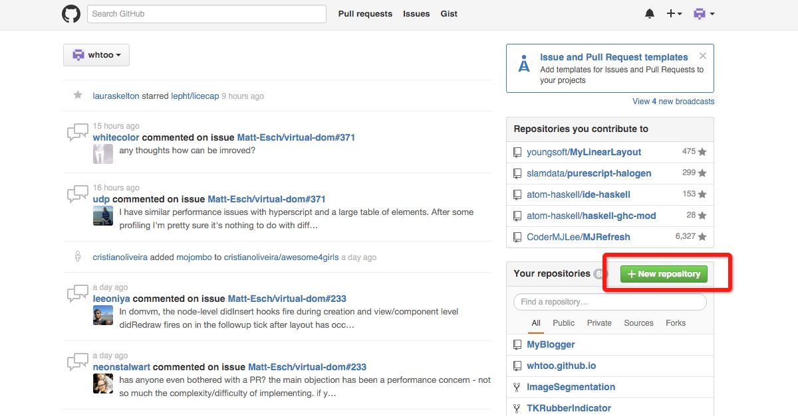
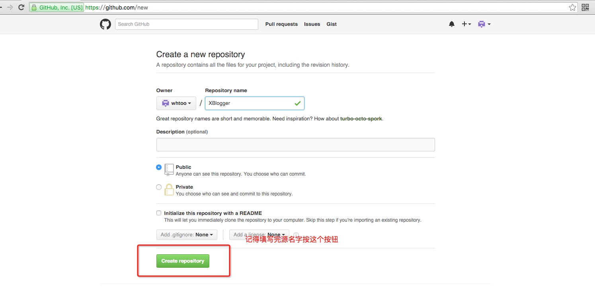
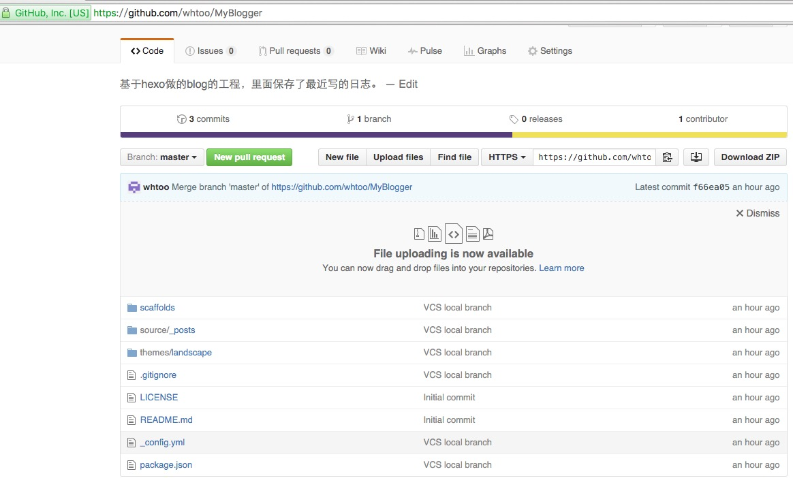

title: 如何将本地工程push到github
---

### 0x01 将本地工程变为Git repository

我的示例工程叫做myblog,其路径是~/WebRoot/myblog

```bash
$ ArthurMac-mini:~ arthur$ cd ~/WebRoot/myblog
$ ArthurMac-mini:myblog arthur$ git init
$ Initialized empty Git repository in ~/WebRoot/myblog/.git/
```
#### 将本地资源添加并提交
```bash
$ ArthurMac-mini:myblog arthur$ git add ./* －－ 将当前目录下所有文件添加到repository
$ ArthurMac-mini:myblog arthur$ git commit -m "VCS local branch"
$ [master (root-commit) 8a46418] VCS local branch
$ ...
```
### 0x02 将本地Git repository和github上的分支做关联
#### 在Github上建立工程

1、进入[Github](https://github.com/)主页，点击创建repository

2、填写必备信息，点击create repository

3、创建成功的页面

#### 在本地设置分支追踪
[GitRemote操作参考](http://blog.csdn.net/wangjia55/article/details/8802490)
```bash
$ ArthurdeMac-mini:myblog arthur$ git branch
$ * master
$ ArthurdeMac-mini:myblog arthur$ git remote add origin https://github.com/whtoo/MyBlogger.git
$ ArthurdeMac-mini:myblog arthur$ git branch --set-upstream-to=origin/master master

```
### 0x03 push 本地分支到远程分支
#### 第一次push一定要先pull
```bash
$ ArthurMac-mini:myblog arthur$ git pull
$ Merge made by the 'recursive' strategy.
$ LICENSE   | 21 +++++++++++++++++++++
$ README.md |  2 ++
$ 2 files changed, 23 insertions(+)
$ create mode 100644 LICENSE
$ create mode 100644 README.md
```
#### 最后一步
```bash
$ ArthurMac-mini:myblog arthur$ git push orgin master
$ Counting objects: 101, done.
$ Delta compression using up to 4 threads.
$ Compressing objects: 100% (92/92), done.
```
